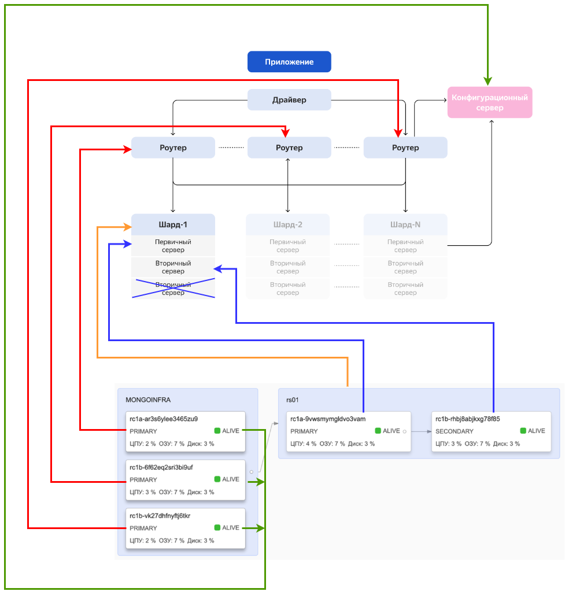
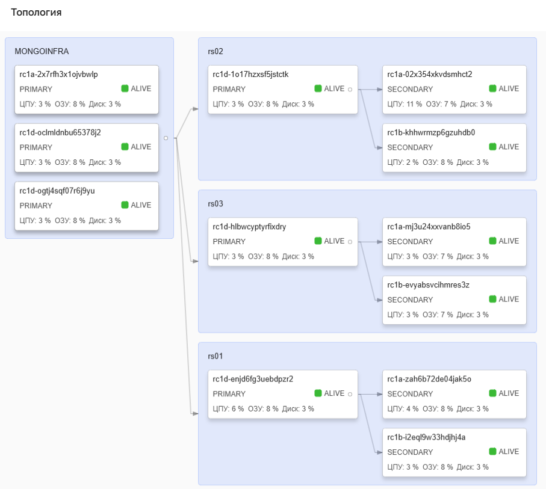

**Сравнение принципиальной диаграммы из задания и топологии сети из урока**
   
[Спринт 1/9 → Тема 3/4: Использование геораспределенных решений облаков → Урок 1/3: Шарды и реплики в геораспределённой среде]( https://practicum.yandex.ru/learn/software-architect/courses/1315e6b2-c6d1-4b30-a7f7-05c6078bc31b/sprints/404735/topics/7dc87ea3-bc68-4d27-b054-e018b1761825/lessons/6c5845ef-6db8-43b2-a031-7bc23e996827/#1e494045-b976-4d6a-8b9e-2c4841c16d6b )

Цветными линиями сопоставлены роли разных частей системы

---

**Топология сети, которую надо реализовать в задании, настроенная в YandexCloud**

