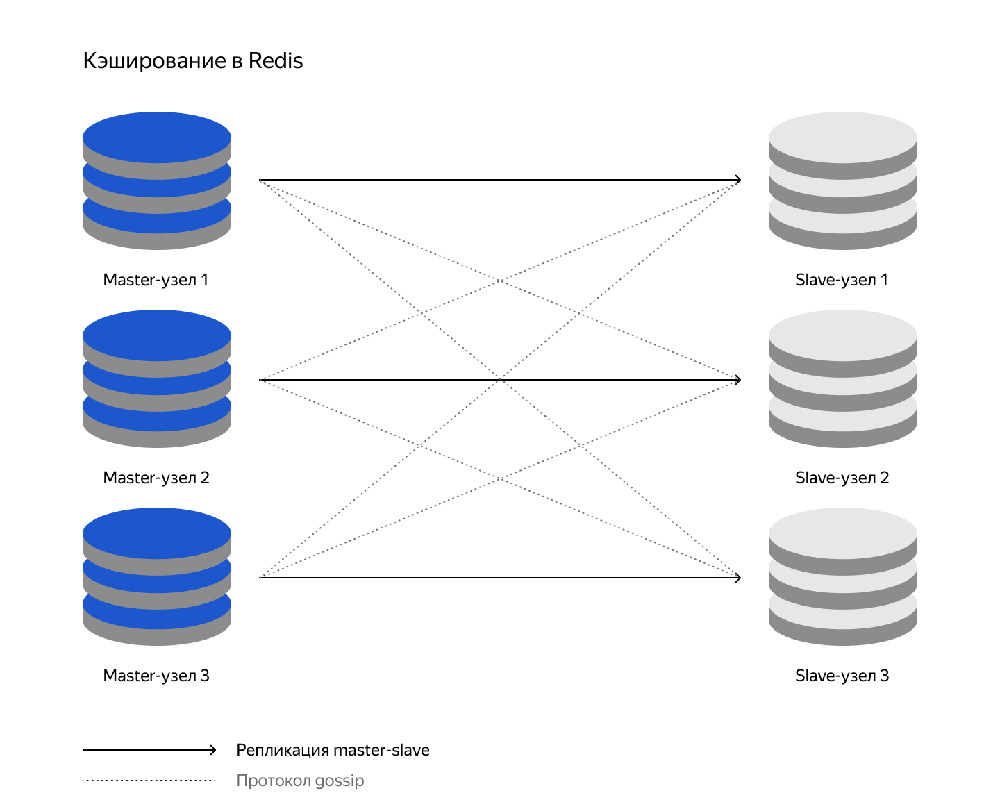
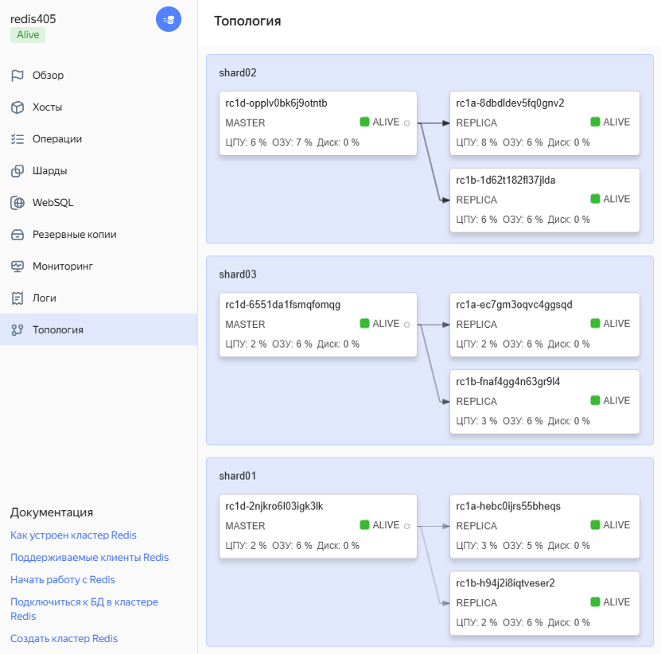

**Принципиальная диаграмма кластера Redis для локальной инфраструктуры из задания**

---

**Топология Redis кластера, которую надо реализовать в задании, настроенная в YandexCloud**

[Спринт 1/9 → Тема 3/4: Использование геораспределенных решений облаков → Урок 2/3: Распределённое кеширование]( https://practicum.yandex.ru/learn/software-architect/courses/1315e6b2-c6d1-4b30-a7f7-05c6078bc31b/sprints/404735/topics/7dc87ea3-bc68-4d27-b054-e018b1761825/lessons/e4bca098-c9c4-4b2a-9cd9-07f2234ceccd/#4cf5e5da-4e8d-4a65-a7a8-c441db1119c9 )

